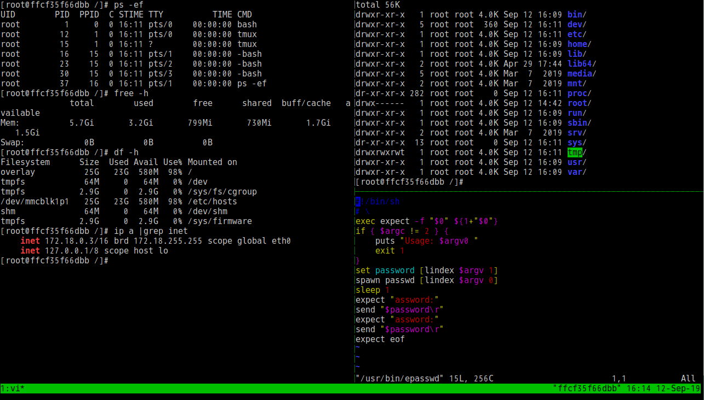

# Alpine-ext

> Lite secure and better use image based on alpine with tmux/gosu/lrzsz/... and other init sys soft and dotfiles.(~30MB) 

`docker run -it --rm -u root infrastlabs/alpine-ext bash`




## [Example](https://github.com/infrastlabs/alpine-ext/blob/master/example.md)

## Intro

 **[Alpine-ext](https://hub.docker.com/r/infrastlabs/alpine-ext)** Image based on `alpine-3.8_glibc-2.28` from `frolvlad/alpine-glibc`. (Size at ~30MB)

### Tags

* bin (downloading and compiling binaries for alpine-ext.)
* latest (alpine-ext image.)
* example (sub example with grpasswd, gosu usage.)

### Features

Alpine-ext with following features:

* apk mirror aliyun/ustc (China)
* TIMEZONE Asia/Shanghai (China)
* bin: tmux, gosu, lrzsz
* apk: curl wget sed grep gawk findutils sudo tree unzip procps htop bash bash-completion vim
* dotfiles: .bashrc .profile .tmux.conf
* gosuctl: gsc add xxx; gsc drop
* user: root; entry

### Shell-Bins

* gsc gosuctl: gsc add entry, gsc drop
* epasswd: expect passwd (must exec with root)
* erpasswd: expect random passwd (recommended random pw for docker, save when build, for safety )

### Environment variables

The environment variables can be used to configure SSH server

| Variable      | Default | Description |
| ------------- | -------------- |---------|
| TIMEZONE      | Asia/Shanghai  |  China  |
| LANG          | C.UTF-8        |         |
| VER           | v1.0           |         |

### Security

- user with entry (none root)

- image check: [dive](https://github.com/wagoodman/dive) [clair](https://github.com/coreos/clair) (TODO)

- CAIID

```
docker inspect frolvlad/alpine-glibc:alpine-3.8_glibc-2.28 -f "{{.RepoDigests}}"
[frolvlad/alpine-glibc@sha256:51d816dfedfaf89e52319add7cf5849dbf7295ec8980ca4a58ac963aa1485a10]
```

- suid sgid

`for i in $(find / -type f \( -perm +6000 -o -perm +2000 \)); do chmod ug-s $i; done`

```
/usr/bin/passwd
/usr/bin/chage
/usr/bin/sudo
/usr/bin/chfn
/usr/bin/newgrp
/usr/bin/chsh
/usr/bin/expiry
/usr/bin/gpasswd
/bin/busybox
/bin/su
/sbin/unix_chkpwd
```

## Usage

- tmux

Tmux 2.3, compatible with vim 8.1

```bash
entry:
tmux #new
tmux att -dt 0 #exist
```

```
control:
  super: ctrl+a
split v: super + \
split h: super + -
   move: super + up/down/left/right 
```

- gosu

Avoid to use su with a external pid and interactive promotion for password.  
> First in give suid to normal user when img built, Then when your container first startup you can do sth with root for the initial(remember to drop suid with gosu).

```bash
gsc add xxx #exec when img build
```

```bash
#scripts to run
file=/tmp/gosu-root.sh
cat > $file <<EOF
ls -la /root
chown -R www:www /srv #test
erpasswd root
gsc drop #drop suid of gosu, for safety
EOF
chmod +x $file

printf "gosu exec as root:(exec when container first startup)"
gosu root bash -c $file && rm -f $file
```

- lrzsz

When in windows or ZModem supported, you can use rz/sz for quick file transmission

```
  upload: rz file
download: sz file
```

## Build Aliyun


- registry login

```bash
#registry
repo=docker.io #registry.cn-shenzhen.aliyuncs.com
source ~/.auth-docker-registry #set DOCKER_REGISTRY_PW DOCKER_REGISTRY_USER
#export |grep DOCKER_REG
echo "${DOCKER_REGISTRY_PW}" |docker login --username=${DOCKER_REGISTRY_USER} --password-stdin $repo
```

- build push

```bash
ns=infrastlabs #k-pub
ver=v1.0 #latest
cur=$(cd "$(dirname "$0")"; pwd) 

#bin
parent=$repo/$ns/alpine-ext-bin:$ver
#docker build --pull -t $parent $cur/bin/.
#src
docker build --pull -t $repo/$ns/alpine-ext:$ver --build-arg parent=$parent  $cur/src/. 
docker push $repo/$ns/alpine-ext:$ver
```


## Contribute

`alpine-ext` is an open source project under the Apache 2.0 license, and contributions are gladly welcomed!
To submit your changes please open a pull request.
