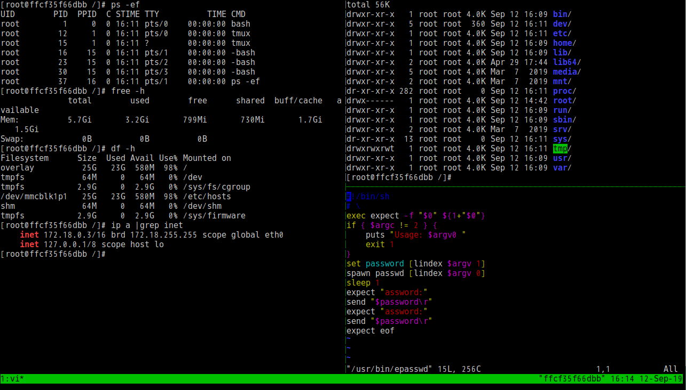

# Alpine-ext

 **[Alpine-ext](https://hub.docker.com/r/infrastlabs/alpine-ext)** an alpine extend Image based on `alpine-3.8_glibc-2.28` from `frolvlad/alpine-glibc`. With optimization and the essential apks like `tmux` `gosu` `lrzsz` `wget` `tree` `procps` `bash` preinstalled , for **lite** **secure** and **convenience**. (Size at ~30MB)

## Directories

* [src](docs/README.md) (Detail usage of `Alpine-ext` image)
* [example-gosu](docs/example.md) (Sub image of `Alpine-ext`, with `grpasswd`, `gosu` usage)
* example-weak (just a tag for convinience, with weak password `root:root` `entry:entry`)
* [binary](docs/binary.md)

## QuickStart

- docker hub: `docker run -it --rm -u root infrastlabs/alpine-ext bash`
- aliyun registry: `docker run -it --rm -u root registry.cn-shenzhen.aliyuncs.com/infrastlabs/alpine-ext bash`
- weak for debug: `docker run -it --rm registry.cn-shenzhen.aliyuncs.com/infrastlabs/alpine-ext:weak bash`

## Features

Alpine-ext with following initial:

* apk mirror aliyun/ustc (China)
* TIMEZONE Asia/Shanghai (China)
* apks: curl wget sed grep gawk findutils sudo tree unzip procps htop bash bash-completion vim
* 
* binary: `tmux`, `gosu`, `lrzsz`
* shell-bins: `gosuctl` `epasswd` `erpasswd`
* dotfiles: .bashrc .profile .tmux.conf
* init user: `root`, `entry`

## Contribute

`Alpine-ext` is an open source project under the Apache 2.0 license, and contributions are gladly welcomed!
To submit your changes please open a pull request.

## TODO

- ~~$repo param for both dockerhub/aliyun~~ Done.
