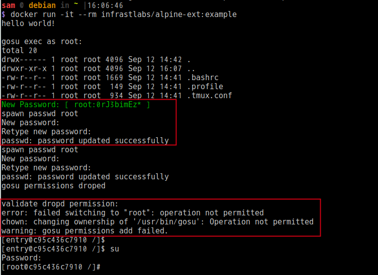

# Alpine-ext: sub image example

## gosu usage

> Avoid to use su with a external pid and interactive promotion for password.  

First give suid to normal user when img built, Then when your container first startup you can do something with root for the initial. (remember to drop suid with gosu)

## gosu example

There be a sub image of Alpine-ext. With following steps to test the feature of gosu.

- add a new user `www`
- random password for `root` `entry` `www`
- `gosu` usage
  - grant root's permision to `www` (when build)
  - change root's password:  `gosu root bash -c /tmp/gosu-root.sh` (just test in entry.sh)
  - drop suid of `gosu`
  - validate the droped permission

## Files

- build.sh #the dokcer build scripts
- entry.sh #entrypoint
- Dockerfile

## QuickStart

`docker run -it --rm infrastlabs/alpine-ext:example`

