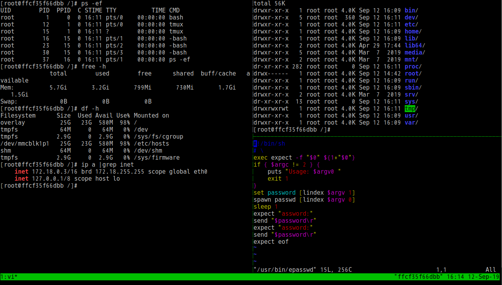

# QuickStart

## alpine-ext
- `alpine-ext:latest` with tmux (run with container's user `root`)

`docker run -it --rm -u root infrastlabs/alpine-ext bash`



## alpine-ext:example

- `alpine-ext:example` with gosu (exec in bash: `su` with root's pw `root`)

`docker run -it --rm infrastlabs/alpine-ext:example`

`entry.sh` in example:

```bash
#!/usr/bin/env bash
echo $@

#scripts to run
file=/tmp/gosu-root.sh
cat > $file <<EOF
ls -la /root
chown -R www:www /srv #test
erpasswd root
epasswd root root  #rechange root's pw to: root (example with weak password)
gsc drop #add this
EOF
chmod +x $file

printf "\ngosu exec as root:\n"
gosu root bash -c $file && rm -f $file

printf "\nvalidate dropd permission:\n"
gosu root ls -la /root
gsc add entry

exec /bin/bash
```


